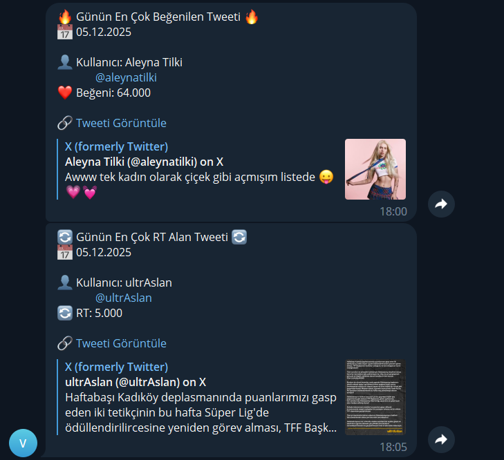
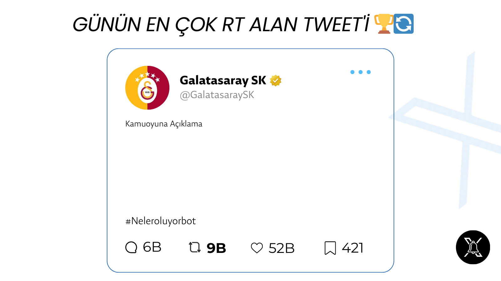

<div align="center">
  
</div>

# ViralTweet - Automated Social Media Trend Tracker


**ViralTweet** is an advanced Python tool designed to analyze social media trends automatically and report high-engagement content. Powered by a robust Playwright scraping engine, it identifies the most popular posts based on specific criteria (likes, retweets, etc.) and sends instant notifications via Telegram.

### 🚀 Features

*   **Smart Scraping:** Seamless data collection on modern web apps using Playwright.
*   **Advanced Filtering:** Precise search based on date, language, like count, and retweet count.
*   **Auto Notifications:** Instant reporting of top content via Telegram bot.
*   **Human-like Behavior:** Natural navigation simulation to bypass bot detection.
*   **Cookie Management:** Secure cookie handling for session persistence.

### 🛠️ Installation

1.  **Clone the Repository:**
    ```bash
    git clone https://github.com/ardakilicaslan/viral-tweet.git
    cd ViralTweet
    ```

2.  **Create a Virtual Environment (Recommended):**
    ```bash
    python -m venv venv
    # For Windows:
    venv\Scripts\activate
    # For Mac/Linux:
    source venv/bin/activate
    ```

3.  **Install Dependencies:**
    ```bash
    pip install -r requirements.txt
    playwright install chromium
    ```

### 🍪 How to Get Cookies

Since Twitter requires login for search, you need to provide your cookies. This is safe and local.

1.  Install **[EditThisCookie](https://chrome.google.com/webstore/detail/editthiscookie/fngmhnnpilhplaeedifhccceomclgfbg)** extension on Chrome/Edge.
2.  Log in to Twitter (X.com).
3.  Click the extension icon and click "Export" (Copies to clipboard).
4.  Create a file named `cookies.json` in the project folder.
5.  Paste the content and save.

### ⚙️ Configuration

1.  Rename `.env.example` to `.env`.
2.  Enter your Telegram Bot credentials:
    ```env
    BOT_TOKEN=your_bot_token
    CHAT_ID=your_chat_id
    ```

### ▶️ Usage

To start the application:

```bash
python main.py
```

The system will automatically scan for the most popular Turkish content from the last 24 hours and forward the results to your Telegram channel.

### 📸 Screenshots (Proof)

Evidence of the bot working (Telegram Notifications):

<div align="center">
  
</div>

<!-- Other Proofs -->
<div align="center">
  
  
</div>

### 🔴 Live Demo

Check out the active Twitter account managed by this bot:
**[➡️ @Neleroluyorbot (Click to View)](https://x.com/Neleroluyorbot)**

### 👨‍💻 Developer

Developed by **[@ardakilicaslan](https://twitter.com/ardakilicaslan)**.

### ⚠️ Disclaimer

This project is for educational and research purposes only. Users are responsible for complying with the Terms of Service (ToS) of the target platforms. The developer assumes no liability for the misuse of this tool.
